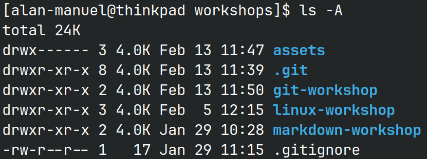
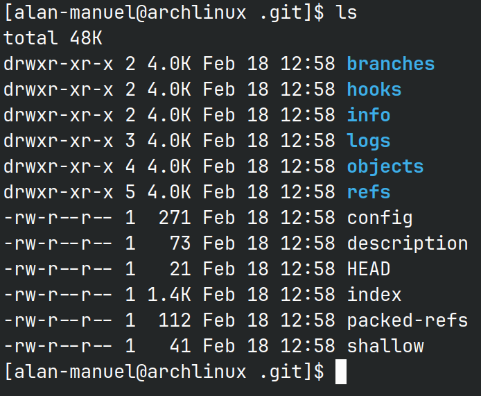
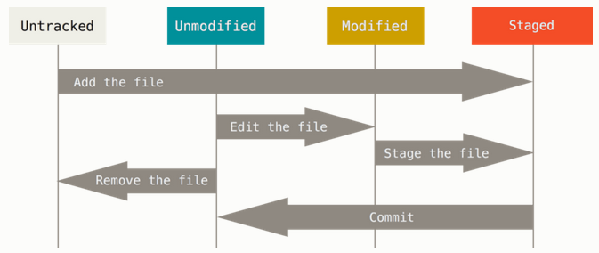
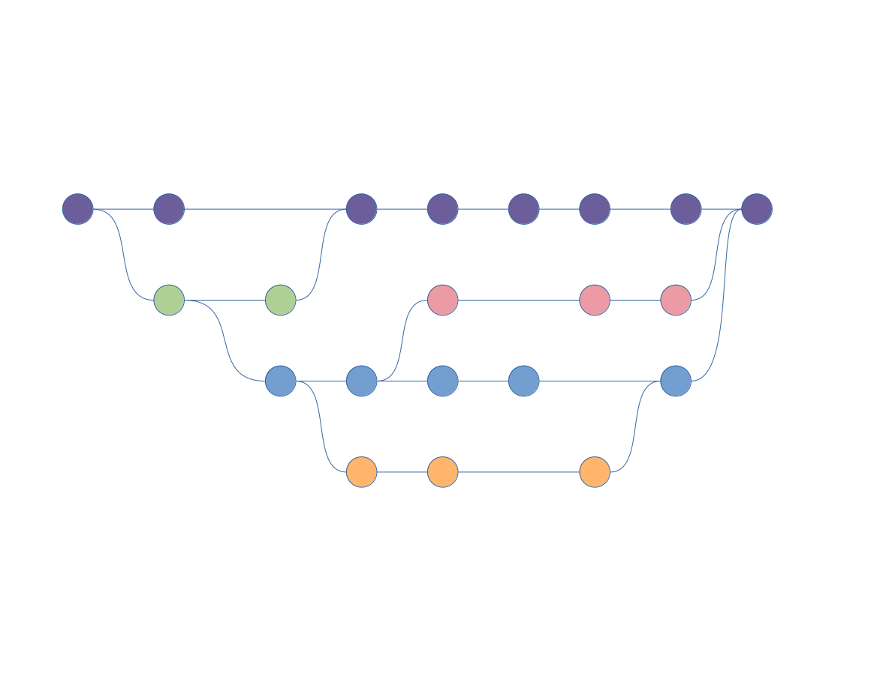
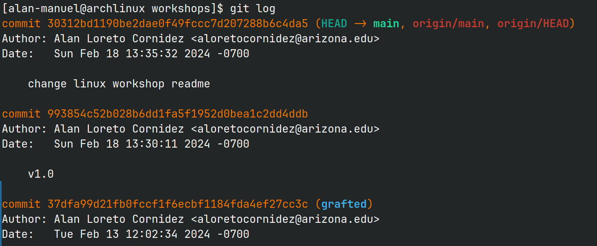

# Git Workshop

Presenter: Alan Manuel Loreto Cornídez

Tentative Presentation Date: February 19th, 5:00 PM

## What is Git?

Git is a distributed version control system designed to track changes in source
code during software development. It allows multiple developers to collaborate
on a project simultaneously without interfering with each other's work.

Git Features:

- Distributed: Developers each have a copy of the code on their own systems.
- Branching/Merging: Developers can implement features and bug fixes on without
  affecting the main codebase.
- Revision history: Did you delete all of your code by accident? No worries if
  you have a git repository you can recover any previous commit states.

## What is Github?

Often times, people will ignore or confuse the differences between git and
Github.

As we have already established, git is the software that performs version
control on your repository.

Github is a site the hosts git repositories. Github is not the only site that
hosts git repositories. Here are some other sites that also host git
repositories:

- Bitbucket
- Gitlab
- Random Servers

## How can I use `git`?

There are multiple ways to use git.

- Using the [GitHub Desktop](https://desktop.github.com/) app
- Using the [git shell](https://git-scm.com/)
- Using editor add-ons (VsCode, Visual Studio, XCode)
- Working directly on the website.

### What do I recommend?

I recommend you begin by using the GitHub desktop app while slowly transitioning
to using the command line to the point of being comfortable with the CLI. After
you get comfortable with the CLI you can continue using the desktop app and then
use the command line when you need to do something more complex.

## How Does Git Work?

### git repo information is stored within the `.git/` folder

A `git` repository is a folder with a `.git/` folder also contained within all
of the folders. The `git` app tracks all of the changes within that folder and
places all of the information inside of the `.git/` folder.



The .git folder contains all of the information necessary for the git
repository.



### File States

Git tracks changes of files by keeping track of the states of files. After you
make changes that are okay, you can `commit` these changes and store them in the
repo's history.

When would you commit?

- Finished a bug fix
- Implemented a new feature

Let's talk about the states of a file.



1. Untracked files: These are files that are in the same folder as your repo but
   are **not** being tracked by git. Usually, they are newly created files.
2. Unmodified files: These files **are** being tracked by git. Unmodified means
   that the file is not different since you last committed it.
3. Modified files: These files have been modified since your last commit but
   have not been staged for your next commit.
4. Staged files: These files have been modified and are staged for commit. This
   means that the next time you commit, you will store this file's state.

## Let's Demo This Now

I'll be running a simple demo showing how a simple workflow would go using both
the GitHub Desktop app and the Bash Shell.

## Git Features

## `.gitignore files`

Sometimes, you don't want to track files or folders but would like the
conveniences of using more general commands (such as `git add .` instead of
having to add each individual file).

This is a circumstance where `.gitignore` files will come in very useful.

`.gitignores` can be placed in any folder within the git repository and can be
used to ignore files that you don't want to track.

- compiled binaries
- large files
-

Here is what is in my `.gitignore` file for this repository:

```gitignore
.obsidian # ignores my obsidian folder in the root directory.
**.pdf # ignores all my pdfs in all of my folders.
**/.~lock* # ignores all of my lock files generated by libre-office
./**/*.[op] # ignores all files that end in .o and .p
```

## Branching/Merging

Branches are a way for developers to work together on a large project.

You can see the branch-graph history in the following image:



The purple nodes are the main branch. This is what will be released.

The green nodes are a branch that implemented a feature.

The blue nodes are a branchof the green nodes.

The orange nodes branched off of the blue nodes and then merged back in to the
blue nodes at the end.

The red nodes nodes branched off of the blue nodes and were merged back into the
purple nodes.

As you can see, there were 5 different actors in this code base. Branching lets
you fix bugs and implement features as well.

## Reverting changes

If you accidentally remove all of your code in a commit you're able to undo
commits (how do you think I know?).

You have touse the `git log` command to pull up the `hash` of a commit and then
revert to that commit. Below is a screenshot of the logs.



# TLDR

Use git when you need to keep track of changes in a codebase (or any set of
files, with caveats)

Git is the software that keeps track of changes.

Github/Gitlab/Bitbucket are sites that store git repositories.

Usually workflows go like this:

1. Clone (download) a repository from a host (github) (or `git pull` if you
   already have the code on your computer)
2. Make changes to the code inside the folder.
3. Stage the changes using `git add` and then commit them with a message using
   `git commit -m` to the repository history.
4. Push to code to the server.
5. If conflicts exists with your code and the server, then fix the conflicts
   (merge conflicts), then commit(again) the fixes and push the code.

Have fun using git.
